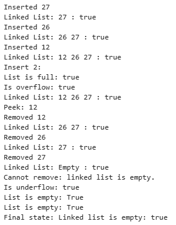

# HandsOn_8

# Problem 1

* Code for quicksort to implement the ith order statistic is given [`QuickSelect.py`](QuickSelect.py)

 
<b>Output:</b>

 
 

# Problem 2

*  Code for Stack Implementation is given [`Stack.py`](Stack.py)
 

<b>Output:</b>

*  Code for Queue Implementation is given [`Queue.py`](Queue.py)
 

<b>Output:</b>

*  Code for SinglyLinkedList Implementation is given [`SinglyLinkedList.py`](SinglyLinkedList.py)
 

<b>Output:</b>

